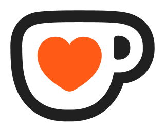

<h1 align="center">Code – Design – Music – GameDev </h1>

  
  English – B2
  &nbsp; | &nbsp;
  
  Russian – Native
  &nbsp; | &nbsp;
  
  Belarusian – Native

  
  Software developer building desktop applications, web tools, backend services and indie games with Unreal Engine

  
  Currently working on a desktop video processing tool using React, FastAPI and Electron

 

  

 

  
  &nbsp;&nbsp;&nbsp;
  
  &nbsp;&nbsp;&nbsp;
  
  &nbsp;&nbsp;&nbsp;
  
  

  

  
  
  
  
  
  
  
  
  
  
  
  
  
  
  
  
  
  
  
  
  
  
  

 

  
  
  
  
  
  
  
  
  
  
  
  
  
  
  
  
  
  
  
  
  
  
  

 

  
  
  
  
  
  
  
  
  
  
  
  
  
  
  
  
  
  
  
  
  
  
  

 

  

 

  
  
  
  
  
  
  

